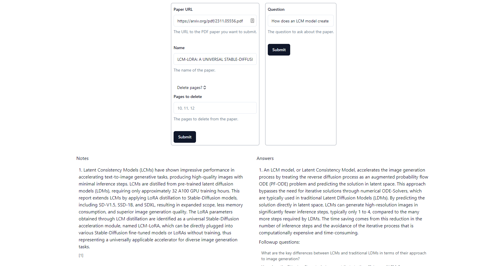
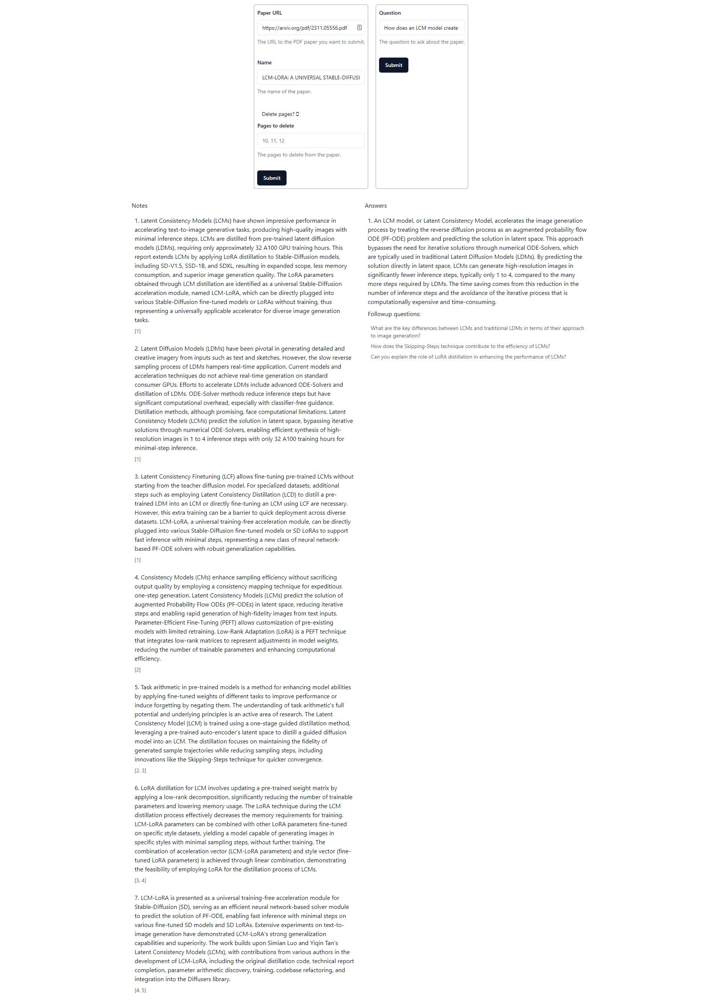

# GPT-4 RAG Demo on Scientific Papers, Notetaking, Q&A, Unstructured semantic extraction, Vectorization, and search with Persistent Chat Context Database

## Demo



## RAG (Retrieval-Augmented Generation) App for Scientific Papers

I made this utility RAG app as a tool designed for testing and experimenting with professor notes on scientific papers, particularly focusing on semantic unstructured data ingestion. This project aims to explore diffusion models and gather insights for personal projects. Leveraging cutting-edge technologies such as GPT-4, Semantic Extraction, Vectorization, and Persistent Chat Context Database, the RAG app offers a comprehensive suite of features aimed at enhancing the research experience.

### Key Features:
- **GPT-4 RAG Demo**: Utilize the 128k context version of OpenAI's GPT-4 model to perform retrieval-augmented generation tasks. Seamlessly generate summaries, extract insights, and answer questions based on scientific papers.
  
- **Notetaking**: Using OpenAI tool calling to capture and organize key points, observations, and annotations from scientific papers. The app supports intuitive notetaking tool functionalities to help users consolidate their understanding and insights.

- **Q&A**: Engage in long and short context aware interactive question-and-answer sessions with the GPT-4 model that ONLY looks into the paper for information through temperature experimentation. 

- **Unstructured Semantic Extraction**: Document ETL - Extract meaningful semantic information and metadata from unstructured scientific papers. Leverage advanced natural language processing techniques to identify and categorize key entities, concepts, and relationships within the text.

- **Vectorization**: Convert textual data from scientific papers into vector representations for enhanced analysis, visualization, and similarity comparison. Gain deeper insights into the semantic meaning and context of research documents.

- **Search with Persistent Chat Context Database**: Seamlessly search through a vast collection of scientific papers using vector database search capabilities. Leverage a persistent chat context database to maintain continuity and coherence in search interactions across sessions.

### Technologies Used:
- **Supabase**: A powerful platform for building scalable and secure backend solutions. The app utilizes Supabase for data storage, user authentication, and real-time collaboration features.

- **Axios**: A popular HTTP client for making requests to external APIs and services. Axios is used to facilitate communication between the frontend and backend components of the RAG app.

- **Express.js**: A minimalist web framework for Node.js used to build robust and efficient server-side applications. Express.js powers the backend infrastructure of the RAG app, handling routing, middleware, and request processing.

- **LangChain**: An advanced natural language processing library for analyzing and processing text data. LangChain enables sophisticated semantic extraction, document summarization, and question-answering functionalities within the RAG app.

- **pdf-lib**: A versatile library for manipulating PDF documents programmatically. The RAG app leverages pdf-lib to extract text, metadata, and structural information from scientific papers in PDF format.

- **pdf-parse**: A lightweight library for parsing and extracting text from PDF documents. pdf-parse is used to extract textual content from scientific papers, enabling further analysis and processing.

- **Zod**: A robust schema validation library for TypeScript. Zod ensures data integrity and consistency within the RAG app by enforcing strict validation rules on input and output data.

## Shortcomings:
- **GPT-4 failures**: Non-deterministic behavior in many sections of the tool pipeline such as not recognizing when it should pass a tool to itself, not extracting meaningful notes in zero-shot or one-shot cases and prompt experimentation is NECESSARY.

- **Semantic Ambiguity**: Despite advancements in natural language processing, the model may struggle with disambiguating complex scientific terminology and context such as mathematical equations. This could lead to missing, inaccurate or misleading professor notes.

## Extensions:
- **Domain-Specific Fine-Tuning**: Fine-tune an open source model using LoRAs on a curated dataset of scientific papers to enhance its understanding of domain-specific terminology and concepts. This could improve the accuracy and relevance of generated professor notes.

- **Custom Prompt Templates**: Develop custom prompt templates tailored to specific types of scientific papers or research domains. These templates can guide users in formulating effective queries and prompts for the RAG model, leading to more informative and contextually relevant professor notes.

- **Output evaluation and requerying**: Implement an evaluation mechanism to assess the quality and relevance of generated professor notes. Allow users to provide feedback on the generated content and requery the model with refined prompts to obtain more accurate and informative results.

- **Interactive Feedback Mechanisms**: Implement interactive feedback mechanisms where users can provide corrections or annotations to generated professor notes. This feedback loop can help refine the model and improve its performance over time.

- **Integration with Knowledge Graphs**: Integrate the RAG app with knowledge graphs or ontologies representing domain-specific knowledge. This could enable more sophisticated semantic understanding and reasoning capabilities, enhancing the quality of generated notes.

- **Multi-Modal Input Support**: Extend the RAG model to accept multi-modal inputs, such as images, figures, and equations, in addition to textual inputs. This would allow for more comprehensive analysis and generation of professor notes from diverse sources of information.


## Development

run this before running the api server
```bash
docker run -p 8000:8000 -d --rm --name unstructured-api quay.io/unstructured-io/unstructured-api:latest --port 8000 --host 0.0.0.0
```

This monorepo uses Turborepo to manage the two packages (web, api).
To build all packages run `yarn build` from root.

To build a specific package run `yarn build --filter=<PACKAGE_NAME>`

To start the API server run `yarn start:api`.
Similarly, to start the web server run `yarn start:web`.

The API is an Express.js server written in TypeScript.
It comes with out of the box support for Supabase.
If you are not developing with Supabase, delete the `gen:supabase:types` script.
If you are using Supabase, replace the `<YOUR_PROJECT_ID>` placeholder with your project ID.

The web project is a default Next.js app with Tailwind CSS and TypeScript.
